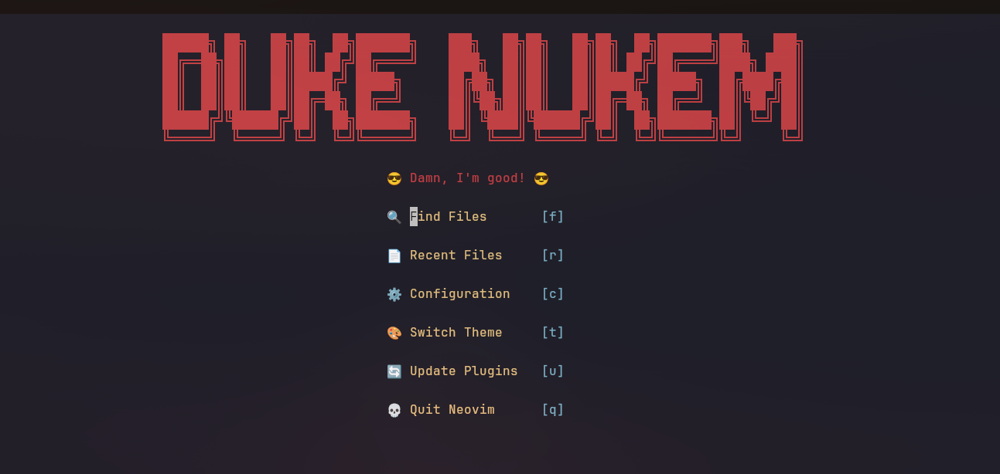

# 🚀 Neovim Configuration - Dvorak Optimized



A modern, feature-rich Neovim configuration specifically optimized for Dvorak keyboard layout users. This configuration provides a powerful development environment with carefully crafted keybindings that work seamlessly with the Dvorak layout.

## ✨ Features

- **Dvorak-Optimized Keybindings**: All keymaps are thoughtfully designed for Dvorak keyboard layout
- **Modern Plugin Management**: Uses [lazy.nvim](https://github.com/folke/lazy.nvim) for fast and efficient plugin loading
- **LSP Integration**: Full Language Server Protocol support for intelligent code completion and diagnostics
- **Vim Command Reference**: Integrated [vim-coach.nvim](https://github.com/shahshlok/vim-coach.nvim) for learning and mastering Vim commands
- **Beautiful Dashboard**: Custom dashboard for a welcoming startup experience
- **Smart Editor Features**: Enhanced editing capabilities with modern Neovim features
- **Consistent Theming**: Carefully selected colorscheme for optimal visual experience

## 📁 Structure

```
nvim/
├── init.lua                 # Main configuration entry point
├── lua/
│   ├── config/
│   │   ├── options.lua      # Neovim options and settings
│   │   ├── keymaps.lua      # Dvorak-optimized keybindings
│   │   └── lazy.lua         # Plugin manager configuration
│   └── plugins/
│       ├── dashboard.lua    # Dashboard configuration
│       ├── editor.lua       # Editor enhancement plugins
│       ├── colorscheme.lua  # Theme and colorscheme settings
│       ├── lsp.lua          # Language Server Protocol setup
│       └── vim-coach.lua    # Vim command reference and learning tool
```

## 🛠️ Requirements

- **Neovim** >= 0.9.0
- **Git** (for plugin management)
- **Node.js** (for some LSP servers)
- **Python 3** with `pynvim` (optional, for Python plugins)
- **Ripgrep** (for telescope fuzzy finding)
- **A Nerd Font** (for icons and symbols)

## 📦 Installation

### Fresh Installation

1. **Backup your existing configuration** (if any):
   ```bash
   mv ~/.config/nvim ~/.config/nvim.backup
   ```

2. **Clone this repository**:
   ```bash
   git clone https://github.com/solotitan/nvim-config.git ~/.config/nvim
   ```

3. **Start Neovim**:
   ```bash
   nvim
   ```

4. **Let lazy.nvim install plugins** (this happens automatically on first run)

### Manual Installation

If you prefer to manually copy files:

1. Create the nvim config directory:
   ```bash
   mkdir -p ~/.config/nvim
   ```

2. Copy all files from this repository to `~/.config/nvim/`

3. Start Neovim and let plugins install automatically

## ⌨️ Dvorak-Optimized Keybindings

This configuration includes keybindings specifically designed for Dvorak keyboard users. Key highlights include:

- **Leader Key**: `<Space>` (easily accessible on Dvorak)
- **Navigation**: Optimized movement keys that feel natural on Dvorak layout
- **Plugin Shortcuts**: All plugin keybindings are mapped to comfortable Dvorak positions

> **Note**: If you're using QWERTY, you may want to review and adjust the keybindings in `lua/config/keymaps.lua`

## 🎯 Vim Coach - Command Reference

This configuration includes [vim-coach.nvim](https://github.com/shahshlok/vim-coach.nvim) by [Shlok Shah](https://github.com/shahshlok), a comprehensive Vim command reference tool that helps you learn and master Vim efficiently.

### Features
- 🔍 **Fuzzy searchable** - Find any command instantly with modern snacks.picker interface
- 📚 **120+ commands** - Comprehensive coverage of Vim motions, editing, visual mode, and plugins
- 🎓 **Beginner-focused** - Detailed explanations with "when to use" guidance
- 🌐 **Context-aware** - Different explanations for file vs explorer vs git contexts
- 💡 **Coaching tips** - Learn WHY and WHEN to use each command
- 📋 **Copy keybinds** - Press Enter or Ctrl+Y to copy commands to clipboard

### Keybindings

| Key | Command | Description |
|-----|---------|-------------|
| `<leader>?` | `:VimCoach` | Open comprehensive command search |
| `<leader>hm` | `:VimCoach motions` | Motion commands (h,j,k,l,w,b,f,etc.) |
| `<leader>he` | `:VimCoach editing` | Editing commands (i,a,d,c,y,p,etc.) |
| `<leader>hv` | `:VimCoach visual` | Visual mode commands |
| `<leader>hp` | `:VimCoach plugins` | Plugin-specific commands |
| `<leader>hh` | `:VimCoach all` | All commands (same as `<leader>?`) |

### Usage
1. Press `<leader>?` (Space + ?) to open the main interface
2. Type to search for commands (e.g., "delete", "move", "copy")
3. Use arrow keys or fuzzy search to navigate
4. Press `Enter` or `Ctrl+Y` to copy a keybind to clipboard
5. Press `Esc` to close the interface

**Credit**: Special thanks to [Shlok Shah](https://github.com/shahshlok) for creating this excellent learning tool!

## 🎨 Customization

### Adding Plugins

Add new plugins in the appropriate file under `lua/plugins/`:

```lua
return {
  "author/plugin-name",
  config = function()
    -- Plugin configuration
  end,
}
```

### Modifying Keybindings

Edit `lua/config/keymaps.lua` to customize keybindings:

```lua
vim.keymap.set("n", "<leader>your_key", ":YourCommand<CR>", { desc = "Description" })
```

### Changing Options

Modify Neovim settings in `lua/config/options.lua`:

```lua
vim.opt.your_option = "your_value"
```

## 🔧 Troubleshooting

### Plugin Issues
- Run `:Lazy sync` to update plugins
- Run `:Lazy clean` to remove unused plugins
- Check `:Lazy log` for installation errors

### LSP Issues
- Run `:LspInfo` to check LSP status
- Ensure required language servers are installed
- Check `:Mason` for LSP server management

### Performance Issues
- Run `:Lazy profile` to check plugin loading times
- Consider disabling unused plugins

## 🤝 Contributing

Feel free to submit issues and pull requests! This configuration is continuously evolving.

## 📄 License

This configuration is open source and available under the [MIT License](LICENSE).

## 🙏 Acknowledgments

- [LazyVim](https://github.com/LazyVim/LazyVim) for inspiration
- [Neovim](https://neovim.io/) community for the amazing editor
- [Shlok Shah](https://github.com/shahshlok) for the excellent [vim-coach.nvim](https://github.com/shahshlok/vim-coach.nvim) plugin
- All plugin authors for their incredible work

---

**Happy coding with Dvorak! 🎹✨**
