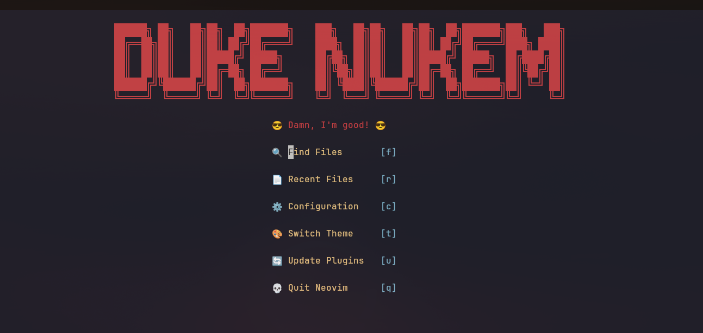

# 🚀 Neovim Configuration



A modern, feature-rich Neovim configuration with intuitive QWERTY keybindings. This configuration provides a powerful development environment with carefully crafted keybindings that enhance productivity.

## ✨ Features

- **Intuitive QWERTY Keybindings**: All keymaps follow familiar vim patterns (hjkl navigation)
- **Modern Plugin Management**: Uses [lazy.nvim](https://github.com/folke/lazy.nvim) for fast and efficient plugin loading
- **LSP Integration**: Full Language Server Protocol support for intelligent code completion and diagnostics
- **Beautiful Dashboard**: Custom dashboard for a welcoming startup experience
- **Smart Editor Features**: Enhanced editing capabilities with modern Neovim features
- **Consistent Theming**: Carefully selected colorscheme for optimal visual experience

## 📁 Structure

```
nvim/
├── init.lua                 # Main configuration entry point
├── lua/
│   ├── config/
│   │   ├── options.lua      # Neovim options and settings
│   │   ├── keymaps.lua      # Dvorak-optimized keybindings
│   │   └── lazy.lua         # Plugin manager configuration
│   └── plugins/
│       ├── dashboard.lua    # Dashboard configuration
│       ├── editor.lua       # Editor enhancement plugins
│       ├── colorscheme.lua  # Theme and colorscheme settings
│       └── lsp.lua          # Language Server Protocol setup
```

## 🛠️ Requirements

- **Neovim** >= 0.9.0
- **Git** (for plugin management)
- **Node.js** (for some LSP servers)
- **Python 3** with `pynvim` (optional, for Python plugins)
- **Ripgrep** (for telescope fuzzy finding)
- **A Nerd Font** (for icons and symbols)

## 📦 Installation

### Fresh Installation

1. **Backup your existing configuration** (if any):
   ```bash
   mv ~/.config/nvim ~/.config/nvim.backup
   ```

2. **Clone this repository**:
   ```bash
   git clone https://github.com/solotitan/nvim-config.git ~/.config/nvim
   ```

3. **Start Neovim**:
   ```bash
   nvim
   ```

4. **Let lazy.nvim install plugins** (this happens automatically on first run)

### Manual Installation

If you prefer to manually copy files:

1. Create the nvim config directory:
   ```bash
   mkdir -p ~/.config/nvim
   ```

2. Copy all files from this repository to `~/.config/nvim/`

3. Start Neovim and let plugins install automatically

## ⌨️ QWERTY Keybindings

This configuration includes intuitive keybindings that follow standard vim conventions. Key highlights include:

- **Leader Key**: `<Space>` (easily accessible)
- **Window Navigation**: `sh/sj/sk/sl` (follows hjkl pattern with 's' prefix)
- **Plugin Shortcuts**: All plugin keybindings are mapped to comfortable positions

> **Note**: See `docs/neovim-keymap-reference.md` for a complete keybinding reference

## 🎨 Customization

### Adding Plugins

Add new plugins in the appropriate file under `lua/plugins/`:

```lua
return {
  "author/plugin-name",
  config = function()
    -- Plugin configuration
  end,
}
```

### Modifying Keybindings

Edit `lua/config/keymaps.lua` to customize keybindings:

```lua
vim.keymap.set("n", "<leader>your_key", ":YourCommand<CR>", { desc = "Description" })
```

### Changing Options

Modify Neovim settings in `lua/config/options.lua`:

```lua
vim.opt.your_option = "your_value"
```

## 🔧 Troubleshooting

### Plugin Issues
- Run `:Lazy sync` to update plugins
- Run `:Lazy clean` to remove unused plugins
- Check `:Lazy log` for installation errors

### LSP Issues
- Run `:LspInfo` to check LSP status
- Ensure required language servers are installed
- Check `:Mason` for LSP server management

### Performance Issues
- Run `:Lazy profile` to check plugin loading times
- Consider disabling unused plugins

## 🤝 Contributing

Feel free to submit issues and pull requests! This configuration is continuously evolving.

## 📄 License

This configuration is open source and available under the [MIT License](LICENSE).

## 🙏 Acknowledgments

- [LazyVim](https://github.com/LazyVim/LazyVim) for inspiration
- [Neovim](https://neovim.io/) community for the amazing editor
- All plugin authors for their incredible work

---

**Happy coding! 🎹✨**
